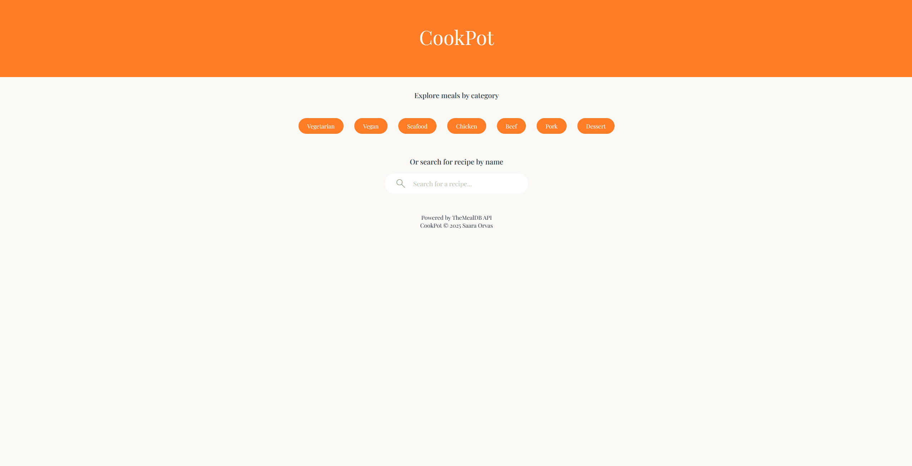
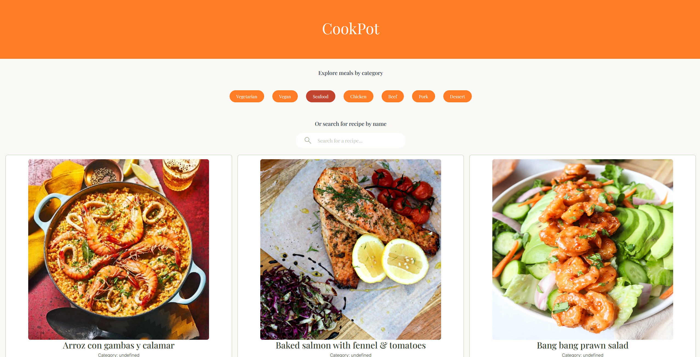

# CookPot - reseptihakusovellus
Tekijä: Saara Orvas

## Verkkolinkit
Linkki videoesittelyyn:

Linkki julkaistuun APIin: [CookPot]

## Oma arvio työstä ja oman osaamisen kehittymisestä
Minulla oli hauskaa sovelluksen suunnittelun ja rakentamisen kanssa, ja olen tyytyväinen omaan projektiini, sillä minulla oli ajatuksena rakentaa omaan käyttööni reseptihakusovellus, jota voisin käyttää arkielämässä. Koen, että onnistuin luomaan helppokäyttöisen hakusovelluksen selkeällä käyttöliittymällä.
Oma osaamiseni on kehittynyt paljon projektin aikana varsinkin API-kutsun tekemisen ja jQueryn käyttämisen osalta, vaikkakin molemmissa on vielä paljon kehittymisen varaa. Oli haasteellista käyttää Axios-kutsua kun AJAX-kutsun tekeminen oli vielä opetteluvaiheessa. jQueryn osalta oli minulla haasteita tehdä click-tapahtuma, koska en aluksi tajunnut, että minun kannattaa lisätä näppäin-elementtiin data-attribuutti, jonka avulla saan tehtyä jQueryllä tapahtuman.
Olisin voinut käyttää projektissa enemmän JavaScript-kirjastoja ulkosasun muokkaamiseen ja efekteihin, mutta olin muotoillut tehnyt jo CSS:llä, kun tämän tajusin, eikä aikaa enää riittänyt etsimään ja oppimaan kirjastojen käyttöä sekä korvaamaan jo tehdyt muokkaukset. 
Antaisin itselleni prokjektista 4/5.

## Sisällysluettelo
- [Tietoja sovelluksesta](#tietoja-sovelluksesta)
- [Kuvakaappaus](#kuvakaappaus)
- [Teknologiat](#teknologiat)
- [Asennus](#asennus)
- [Kiitokset](#kiitokset)
- [Lisenssi](#lisenssi)

## Tietoja sovelluksesta
CookPot on selainpohjainen hakusovellus, jonka avulla käyttäjä voi etsi reseptejä julkisesta TheMealDB rajapinnasta ja tietokannasta. Sovellus tarjoaa selkeän, helppokäyttöisen ja responsiivisen käyttöliittymän, jossa käyttäjä voi joko hakea reseptejä valmiiksi annettujen kategorioiden mukaan tai reseptin nimellä. Hakutulokset tulevat näkyviin reseptikorteissa, joita painamalla ohjautuu käyttäjä reseptin ohjesivulle. Ohjesivulta on painike takaisin tuloksiin.

## Kuvakaappaus
Sovelluksen ulkoasu:

## Teknologiat
Projektin toteutuksessa on käytetty seuraavia teknologioita:

- HTML: Käyttöliittymän rakenteen luominen
- CSS: Ulkoasun, värien ja responsiivisuuden hallinta
- Bootstrap: Responsiivinen ulkoasu ja käyttöliittymän muotoilu
- JavaScript: DOM-manipulaatio, tapahtumien käsittely ja dynaamisen sisällön tuottaminen
- Axios: Tiedonhaku ulkoisesta rajapinnasta
- jQuery: DOM-scriptaus ja muu toiminnallisuus
- Google Fonts: Hakukentän kuvakkeen esittäminen, fontit ja nuoli-ikoni.
- Visual Studio Code: Kehitysympäristö

## Asennus
1. Lataa tai kloonaa tämä repositorio
2. Avaa index.html selaimessa

TAI

Mene [linkistä]() julkaistuun sovellukseen, jolloin repositorion lataaminen ei ole tarpeen.

## Kiitokset
Projektin toteutuksess hyödynnettiin seuraavia lähteitä:
- [TheMealDB](https://www.themealdb.com/api.php)
- [Stackoverflow](https://stackoverflow.com/questions/38312705/how-do-i-toggle-a-class-on-click-of-an-element-but-remove-the-same-class-from-al/38312804)
- [LogRocket](https://blog.logrocket.com/understanding-axios-get-requests/)
- [W3school](https://www.w3schools.com/)
- [Google Fonts](https://fonts.google.com/?selected=Material+Symbols+Outlined:search:FILL@0;wght@400;GRAD@0;opsz@24&icon.size=24&icon.color=%25231f1f1f)
- [Mika Stenberg - Gitbook](https://mika-stenberg.gitbook.io/web-sovelluksia-javascriptin-avulla/jquery/dom-skriptaus)

Projektin kehityksessä on hyödynnetty Microsoft Copilotia erityisesti jQuery-toiminnallisuuksien sekä localStorageen tallentamisen ja poistamisen toteutuksessa.

## Lisenssi

MIT lisenssi @ Saara Orvas